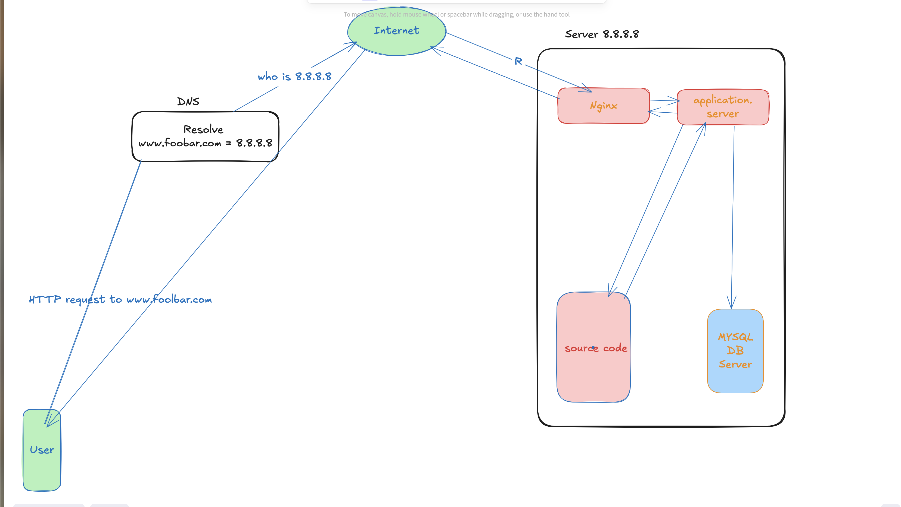
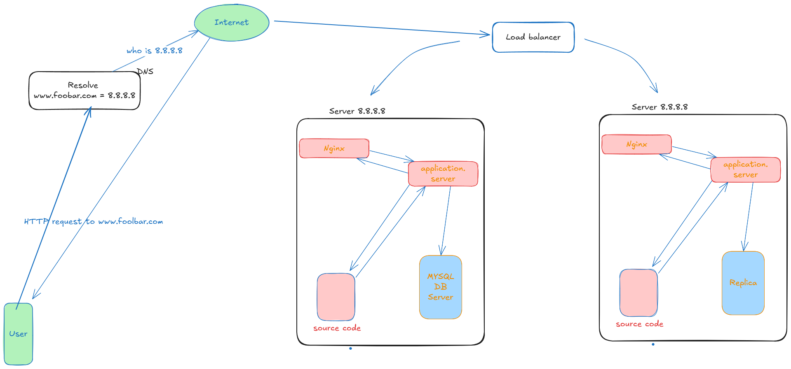

# Web Infrastructure Design

## Simple Web Infrastructure

### Infrastructure Components Explanation

#### What is a Server
A server is a computer system that provides services, resources, or data to other computers (clients) over a network, typically running specialized software to handle requests and deliver responses.

#### Role of the Domain Name
The domain name serves as a human-readable address that maps to the server's IP address, allowing users to access websites using memorable names like "foobar.com" instead of numerical IP addresses.
DNS Record Type for "www"
The "www" in "www.foobar.com" is a subdomain that typically uses a CNAME (Canonical Name) DNS record, which points to the main domain or an A record that resolves to the server's IP address.

#### Role of the Web Server
The web server receives HTTP requests from clients, serves static content like HTML, CSS, and images directly, and forwards dynamic content requests to the application server for processing.

#### Role of the Application Server
The application server executes the business logic of the website, processes dynamic requests, interacts with the database, and generates dynamic content that is sent back through the web server to the client.

#### Role of the Database
The database stores, organizes, and manages the website's persistent data, allowing the application server to create, read, update, and delete information as needed for the website's functionality.

#### Server-Client Communication Protocol
The server uses the HTTP/HTTPS protocol over TCP/IP to communicate with the user's computer, enabling the structured exchange of web requests and responses across the internet.

### Infrastructure Issues

#### Single Point of Failure (SPOF)
The entire infrastructure represents one massive SPOF since all components (web server, application server, and database) reside on a single machine, meaning any hardware failure, software crash, or network issue will make the entire website unavailable.

#### Maintenance Downtime Issue
Downtime is inevitable during maintenance activities such as deploying new code, applying security patches, or restarting services, as there are no backup servers to handle requests while the primary server is being updated.

#### Scaling Limitations
The infrastructure cannot scale to handle increased traffic since all requests must be processed by the single server's limited CPU, memory, and network resources, creating a hard ceiling on the number of concurrent users the system can support.

## Distributed Web Infrastructure

### Infrastructure Components Explanation

#### Load Balancer Addition
The load balancer is added to distribute incoming traffic across multiple application servers, preventing any single server from becoming overwhelmed and ensuring high availability by routing requests away from failed servers.

#### Load Balancer Distribution Algorithm
The load balancer uses a Round Robin distribution algorithm, which works by sequentially forwarding each new request to the next server in the pool, cycling back to the first server after reaching the last one, ensuring equal distribution of requests across all available servers.

#### Active-Active vs Active-Passive Setup
The load balancer enables an Active-Active setup where all servers simultaneously handle requests and share the workload, unlike Active-Passive where only one server handles requests while others remain on standby until the primary fails.

#### Database Primary-Replica Cluster Operation
The Primary-Replica database cluster works by having the Primary node handle all write operations and immediately replicating these changes to one or more Replica nodes, which can serve read requests, providing data redundancy and read scalability.

#### Primary vs Replica Node Differences
The Primary node accepts both read and write operations from the application and serves as the authoritative source of data, while Replica nodes only handle read operations and maintain synchronized copies of the Primary's data to reduce read load and provide backup capabilities.

### Infrastructure Issues

#### Single Points of Failure (SPOF)
The load balancer itself becomes a SPOF since all traffic must pass through it, and if it fails, the entire system becomes inaccessible even if all backend servers are functioning properly.

#### Security Issues - Firewall
The absence of firewalls exposes all servers directly to external threats, allowing unrestricted access to server ports and services that should only be accessible internally or through specific controlled channels.

#### Security Issues - HTTPS
The lack of HTTPS encryption means all data transmitted between clients and servers travels in plain text, making it vulnerable to interception, man-in-the-middle attacks, and data theft.

#### Monitoring Absence
Without monitoring systems in place, there is no visibility into server performance, resource utilization, error rates, or system health, making it impossible to proactively identify issues or optimize performance before problems affect users.

## Secured and Monitored Web Infrastructure

### Infrastructure Components Explanation

#### Additional Element Additions
Each additional element is added to address specific scalability, security, or reliability requirements, such as adding firewalls for security, HTTPS for data protection, and monitoring for operational visibility.

#### Firewall Purpose
Firewalls serve as security barriers that filter network traffic based on predetermined rules, blocking unauthorized access attempts while allowing legitimate traffic to pass through to protected servers.

#### HTTPS Traffic Benefits
Traffic is served over HTTPS to encrypt data in transit between clients and servers, preventing eavesdropping, data tampering, and man-in-the-middle attacks while ensuring data integrity and user privacy.

#### Monitoring Purpose
Monitoring is used to continuously track system performance, resource utilization, error rates, and availability metrics, enabling proactive issue detection and informed capacity planning decisions.

#### Monitoring Data Collection
The monitoring tool collects data through agents installed on servers that gather metrics like CPU usage, memory consumption, disk I/O, and network statistics, then transmit this information to a centralized monitoring dashboard for analysis.

#### Web Server QPS Monitoring
To monitor web server QPS (Queries Per Second), configure the monitoring tool to track HTTP request counts over time intervals, set up dashboards to visualize request rates, and establish alerts for when QPS exceeds or falls below defined thresholds.

### Infrastructure Issues

#### SSL Termination at Load Balancer Issue
Terminating SSL at the load balancer level creates a security vulnerability because traffic between the load balancer and backend servers travels unencrypted, exposing sensitive data to potential interception within the internal network.

#### Single MySQL Write Server Issue
Having only one MySQL server capable of accepting writes creates a critical bottleneck and single point of failure, as all write operations must queue through this server, and its failure would make the entire application read-only or completely unavailable.

#### Monolithic Server Component Problem
Having servers with all the same components (database, web server, and application server) creates resource contention issues, makes scaling individual tiers impossible, and increases complexity for maintenance since each server must handle multiple distinct workloads with different performance characteristics.
